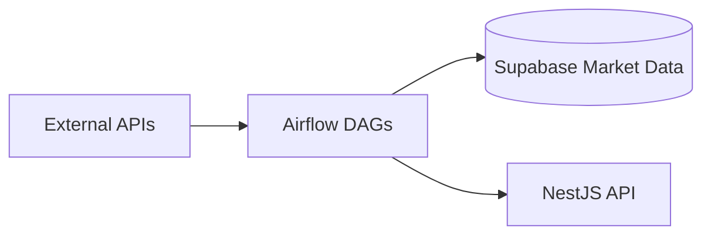

# Data Pipeline

Apache Airflow ETL for the internal **Quant Trading Platform**. Monorepo path: `services/data-pipeline`.

> **Product context:** In-scope markets are VN30/VN30F and USDT crypto per [CONTEXT.md](../../CONTEXT.md). Several DAGs below are **legacy** from the retired Portfolios Tracker B2C product and are scheduled for trim/archive in [plan 13b](../../docs/plans/active/13b-pipeline-cleanup-dag-skeletons.md).

## Monorepo location

| Item                            | Path                                                                     |
| ------------------------------- | ------------------------------------------------------------------------ |
| Service root                    | `services/data-pipeline`                                                 |
| Integration contract            | [docs/contracts/data-pipeline.md](../../docs/contracts/data-pipeline.md) |
| DAG inventory (source of truth) | [docs/DAG-OWNERSHIP.md](./docs/DAG-OWNERSHIP.md)                         |

## Service scope

- Data Engineering owns DAG scheduling/execution and pipeline modules.
- Core API endpoint contracts are co-owned by Core Backend + Data Engineering.
- Platform Engineering owns Airflow/Redis/Postgres runtime and secrets lifecycle.
- Writes market and enrichment data into Supabase.

Operational docs:

- [Quick Start](./docs/QUICK-START.md)
- [Deployment](./docs/DEPLOYMENT.md)
- [Integrations](./docs/INTEGRATIONS.md)
- [Architecture](./docs/ARCHITECTURE.md)
- [DAG Ownership](./docs/DAG-OWNERSHIP.md)
- [Migration Playbook](./docs/MIGRATION-PLAYBOOK.md)
- [Troubleshooting](./docs/TROUBLESHOOTING.md)

## Architecture

- **Orchestrator**: Apache Airflow 3.x (CeleryExecutor)
- **Primary storage**: Supabase Postgres
- **Message broker**: Redis
- **Metadata DB**: PostgreSQL
- **Key providers**: vnstock (VN), CCXT/crypto (planned), Supabase

### Data flow



## Core components

- `dags/`: DAG definitions and task orchestration entrypoints.
- `dags/etl_modules/orchestrators/`: Workflow coordination across providers, transforms, and persistence.
- `dags/etl_modules/adapters/`: External/system-facing I/O boundaries.
- `dags/etl_modules/transformers/`: Pure shaping/normalization logic.
- `dags/etl_modules/settings.py`, `dags/etl_modules/errors.py`: Shared configuration and domain errors.

### Operating model

- Directional flow: `DAG modules -> orchestrator -> adapters + transformers`.
- Shared imports: `from dags.etl_modules...` (see [`docs/ARCHITECTURE.md`](./docs/ARCHITECTURE.md)).

## Test strategy

- **Unit** (`@pytest.mark.unit`): `./run_tests.sh --unit`
- **Integration**: `./run_tests.sh --integration`
- **Validation gates**: `./scripts/validate.sh` (or `VALIDATE_SCOPE=full ./scripts/validate.sh`)

CI: [.github/workflows/ci-validation.yml](../../.github/workflows/ci-validation.yml) (path-filtered on `services/data-pipeline/**`).

## Key workflows (DAGs)

Full schedule table: [DAG Ownership](./docs/DAG-OWNERSHIP.md).

| DAG                               | Schedule              | Status                      | Description                                                 |
| :-------------------------------- | :-------------------- | :-------------------------- | :---------------------------------------------------------- |
| `assets_dimension_etl`            | Weekly (Sun 2 AM ICT) | Pivot (VN trim pending 13b) | Asset master sync; global US/crypto branches to be removed. |
| `market_data_prices_daily`        | Mon–Fri 6 PM ICT      | Active                      | EOD prices for active VN equities.                          |
| `market_data_events_daily`        | Mon–Fri 6:20 PM ICT   | Active                      | Corporate actions/events.                                   |
| `market_data_ratios_weekly`       | Weekly Sun 7 PM ICT   | Active                      | Financial ratios (KBS).                                     |
| `market_data_fundamentals_weekly` | Weekly Sun 7 PM ICT   | Active                      | Income statements and balance sheets.                       |
| `refresh_historical_prices`       | Daily 6:30 PM ICT     | Active                      | 6-year OHLCV refresh after corporate events.                |
| `market_news_morning`             | Mon–Fri 7 AM ICT      | **Legacy**                  | B2C Telegram news digest; candidate for archive.            |
| `portfolio_schedule_snapshot`     | Hourly                | **Legacy**                  | Retail portfolio snapshots via NestJS API.                  |
| `ingest_company_intelligence`     | Weekly Sun 4 AM ICT   | **Legacy**                  | Agentic portfolio pgvector embeddings.                      |
| `asset_promotion_check`           | Daily 1 AM UTC        | **Legacy**                  | Retail on_demand → pipeline_managed promotion.              |

> **Note:** `market_data_evening_batch` was split into the four EOD DAGs above; it no longer exists as a single DAG file.

## Local development

### Prerequisites

- Docker and Docker Compose
- `uv` (optional for host-side pytest)

### Setup

```bash
cd services/data-pipeline
cp .env.example .env
docker compose up -d
```

- Airflow UI: [http://localhost:8080](http://localhost:8080)
- Flower: [http://localhost:5555](http://localhost:5555)

### Running tests

```bash
cd services/data-pipeline
./run_tests.sh
./scripts/validate.sh
```

## Configuration

Key environment variables in `.env`:

- `NESTJS_API_URL` — NestJS base URL for API-triggered DAGs (e.g. `portfolio_schedule_snapshot`).
- `DATA_PIPELINE_API_KEY` — `X-Api-Key` for protected batch endpoints.
- `SUPABASE_URL` / `SUPABASE_SECRET_OR_SERVICE_ROLE_KEY` / `SUPABASE_DB_URL`
- `TELEGRAM_BOT_TOKEN` / `TELEGRAM_CHAT_ID` / `GEMINI_API_KEY` — legacy news DAG only.
- `AIRFLOW_POOL_VCI_GRAPHQL_SLOTS` / `AIRFLOW_POOL_KBS_FINANCE_SLOTS` — default `8` each.
